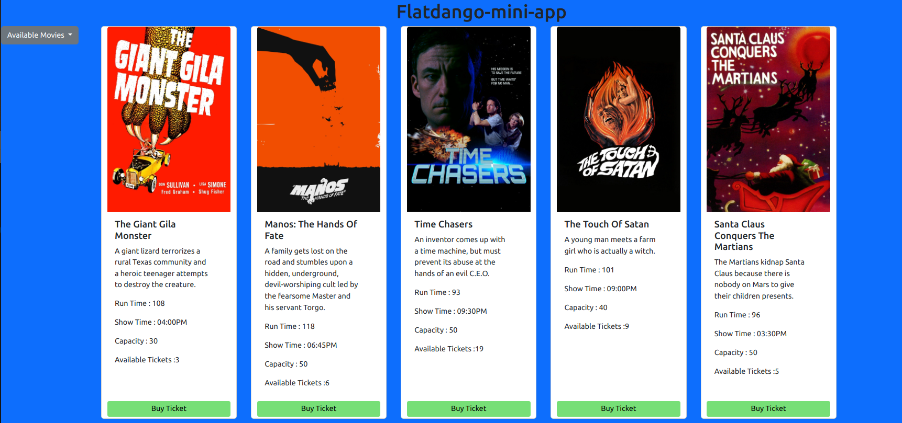
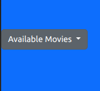
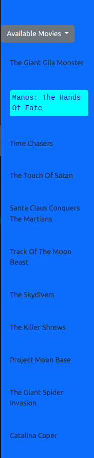
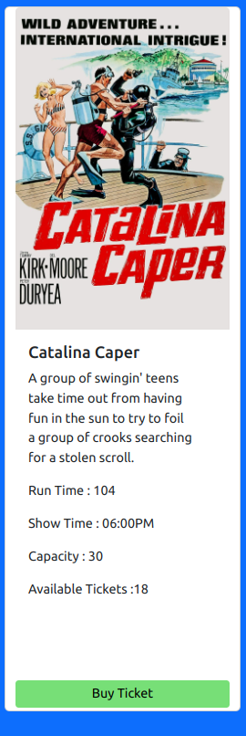

# Flatdango-mini-app
Flatdango mini app is a movie based application thats enables a user to view the available movies,each movies
details including the time and the number of available seats 

## Project Description  

> This project is based on the three pillars of javascript which are:
* DOM manipulation
* Event listners
* Communication with the server
> Flatdango is a a movie mini app that displays a set of movies from the server and the details of a movie.
  one can also buy a ticket where there is a max number of people per movie

### Acknowledgment
* [How to use bootstrap](https://getbootstrap.com/)
* [How to handle event listners](https://developer.mozilla.org/en-US/docs/Web/Events/Event_handlers)
* [Json server](https://www.npmjs.com/package/json-server)

### How the project works
As described above about flatdango now we are looking how the project looks in general and how it works.
> Flatdango is a web application to book space for watching a movie in a theatre, there are several movies available 
  and will be displayed above with each movie and is ditails below and a booking spot.

   

> To see a list of all available movies click the drop down on the left and press *Top Play*

  

>  After pressing a dropdown list will appear of all the available movies 

  

>  To book a spot for your movie click the button 'buy ticket'

  

  This is a more developed website to make the users work easy as they use the website


## Run locally
first start by making a copy of the project on your GitHub account and clone it to the local computer to be able to access the project

Go to the project directory

```bash
  cd Flatdango-mini-app
```

open folder in text editor 

```bash
  code .
```

on the terninal

````bash
json-server --watch db.json 

````

Follow the instruction above to use and run the project localy.  


## Lessons Learned

* Through this project i have learned how to :
  * communicating with the server.
  * listenig to events on the DOM.
  * manipulating the DOM.

  ## 🚀 About Me
 * I'm a full stack developer
 * find me [here](https://github.com/irungudenninganga)

 ## Author

  * [irungudennis](https://github.com/irungudenninganga)

## License 
MIT License

Copyright (c) 2023 irungudennisnganga

>Permission is hereby granted, free of charge, to any person obtaining a copy
of this software and associated documentation files (the "Software"), to deal
in the Software without restriction, including without limitation the rights
to use, copy, modify, merge, publish, distribute, sublicense, and/or sell
copies of the Software, and to permit persons to whom the Software is
furnished to do so, subject to the following conditions:

>The above copyright notice and this permission notice shall be included in all
copies or substantial portions of the Software.

>THE SOFTWARE IS PROVIDED "AS IS", WITHOUT WARRANTY OF ANY KIND, EXPRESS OR
IMPLIED, INCLUDING BUT NOT LIMITED TO THE WARRANTIES OF MERCHANTABILITY,
FITNESS FOR A PARTICULAR PURPOSE AND NONINFRINGEMENT. IN NO EVENT SHALL THE
AUTHORS OR COPYRIGHT HOLDERS BE LIABLE FOR ANY CLAIM, DAMAGES OR OTHER
LIABILITY, WHETHER IN AN ACTION OF CONTRACT, TORT OR OTHERWISE, ARISING FROM,
OUT OF OR IN CONNECTION WITH THE SOFTWARE OR THE USE OR OTHER DEALINGS IN THE
SOFTWARE.  
